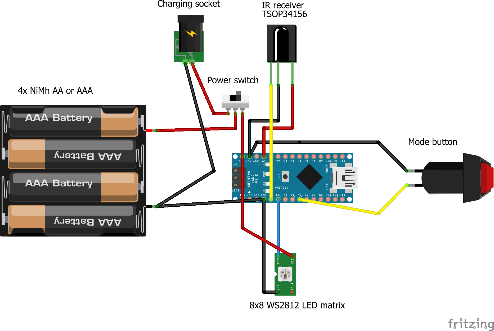

# Matrix target

This is a simple testing/practice target that recognises WoW/UKLTA DoT and MilesTag/LaserWar.

There is a 3D printed enclosure that is fairly deep so you can be flexible about how you wire it up and mount the batteries. Ideally use 4xNiMh AA batteries, or anything that supplies approximately 5v, or includes a regulator to provide 5v. You could power it from an external USB power bank if you with. Do not use 4x Alkaline batteries, the 6v they provide will most likely destroy the LED matrix.

It has a single IR receiver so needs to be hi squarely from the front of the enclosure.

## Using the target

The target should flash white every second as soon as you turn it on and can be hit with Lasertag.

There is a single button that can change the brightness or change mode. A short push on the button changes the brightness, a long push changes the mode.

### Mode 1

The target flashes a different colour when hit.

If the hit is WoW or UKLTA DoT the target will flash red (fatal) or blue (stun) a number of times corresponding to the amount of damage the hit does.

If the hit is MilesTag/LaserWar the target will flash once in the colour of the team the hit came from. It does not count the hits in flashes as this number can be quite high.

### Mode 2

The target flashes identically to Mode 1 but then scrolls some text showing more detail on the hit. For MilesTag/LaserWar this will include the weapon/player ID. For WoW/UKLTA DoT it will show if it was WoW or DoT and any further information.  UKLTA DoT can include a lot of supplementary information such as ongoing damage, armour piercing etc. etc.

Mode 2 is useful when setting up and testing to show all the detail, mode 1 is best when practicing.

## Bill of materials

- Arduino Nano (old AtMega328p model, original or clone)
- Vishay TSOP32156 IR receiver (or equivalent that accepts a 56Khz carrier frequency)
- Momentary, normally open button for the mode switch
- 8x8 WS2812 LED matrix, 65mm on each side to fit the case
- Piece of 2mm white acrylic 80mm x 80mm to act as a diffuser
- On/off switch, ideally SPDT
- Charging socket if using NiMh batteries, usually 2.1/5.5mm barrel jack

## Wiring diagram

This is not a complicated device, you can freeform from this as a guide.

The power switch and charging socket are wired like this so you cannot have the device charging and switched on at the same time. Smart NiMh chargers may provide quite high voltages at high currents that could damage the Arduino.

The LED matrix is wired directly to the power switch, not the 5V regulator of the Arduino, as it can draw quite a lot of current at full brightness.

## Firmware

There are two variants of the firmware. This is because there are two common variants of the 8x8 LED matrices. One variant has the LEDs connected in left-to-right rows, the other variant has them alternating left-to-right then right to left. If your display is corrupted after flashing, try the other variant.

To flash the firmware, either use XLoader (Windows only) or once I can work out the mechanism I'll add direct WebSerial flashing for Chrome users (all platforms).

